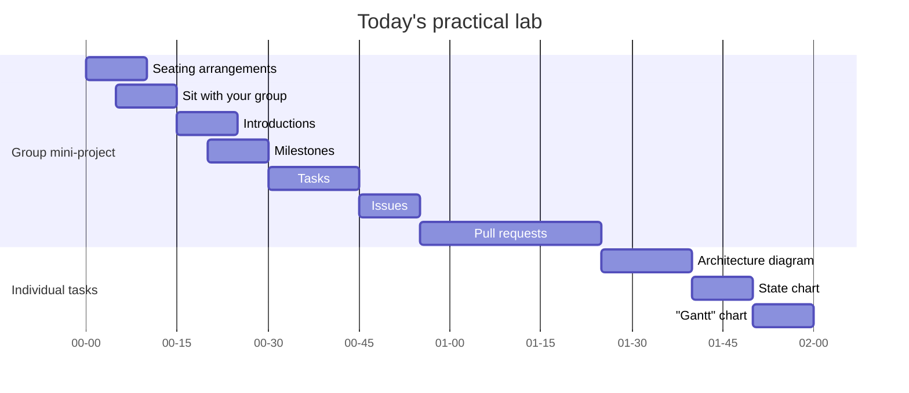

```mermaid
gantt
    title Today's practical lab
    dateFormat HH:mm
    axisFormat %H-%M

    section Group mini-project
    Seating arrangements : 00:00, 10m
    Sit with your group : 00:05, 10m
    Introductions : 00:15, 10m
    Milestones : 00:20, 10m
    Tasks : 00:30, 15m
    Issues : 00:45, 10m
    Pull requests : 00:55, 30m

    section Individual tasks
    Architecture diagram : 01:25, 15m
    State chart : 01:40, 10m
    "Gantt" chart : 01:50, 10m
```
